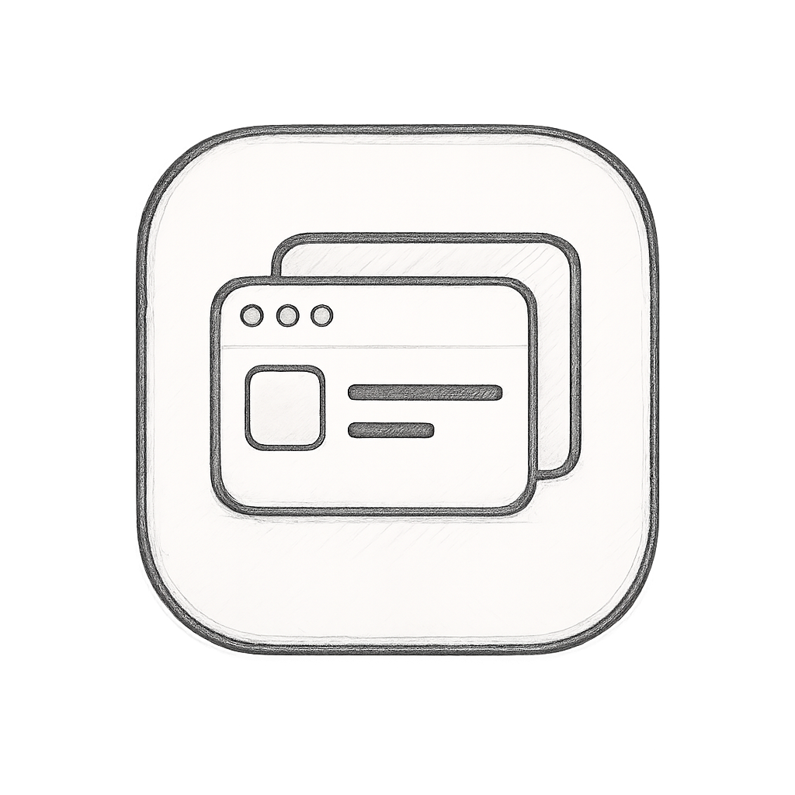
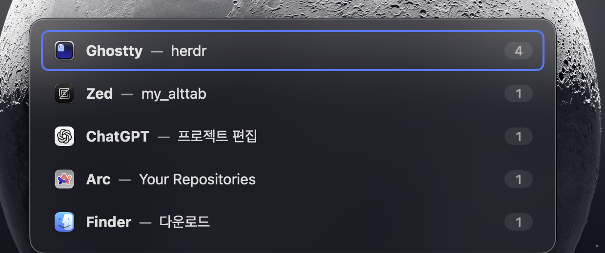
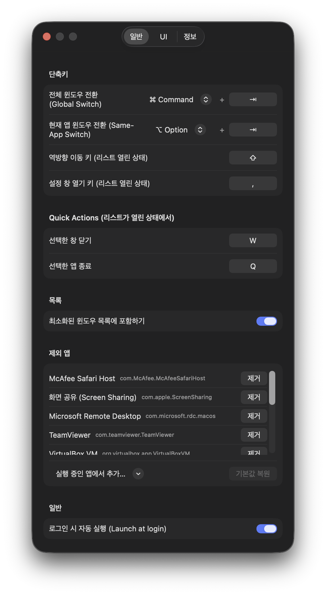

<p align="center">
  
</p>

# My AltTab

[English](README.md)

빠르고 가벼운 macOS 텍스트 기반 윈도우 전환기. 윈도우 미리보기 없이 앱 이름과
윈도우 제목만으로 전환합니다. 화면 기록 권한 없이 동작하며, 다른 Space의 창을
표시하는 기능만 선택적으로 그 권한을 사용합니다.

<p align="center">
  
</p>

## 기능

- **Option + Tab** — 전체 윈도우 전환 (Option을 누른 채 Tab으로 순환, 떼면 전환)
- **Option + `** — 현재 앱의 윈도우만 전환
- **MRU 정렬** — 최근 사용 순으로 정렬되어, 단축키 한 번으로 최근 두 윈도우
  사이를 토글
- **Quick Actions** — 리스트가 열린 상태에서 `W`는 선택한 창 닫기, `Q`는
  해당 앱 종료
- **역방향 이동** — `Shift` 키로 선택을 뒤로 이동
- **설정 키** — 리스트가 열린 상태에서 `,`로 설정 창 열기
- **다국어** — 영어 / 한국어, 시스템 언어를 따름 (설정에서 직접 선택도 가능)
- **모든 Space (선택)** — 활성 Space뿐 아니라 모든 Space의 창을 표시. 다른
  Space 창의 제목을 읽으려면 화면 기록 권한 필요 (기본 꺼짐)
- **앱 제외 목록** — 원격 데스크톱/VM 뷰어는 기본 제외 (AltTab의 목록 채택),
  설정에서 추가/제거 가능
- 최소화된 윈도우는 흐리게 + "(최소화됨)" 표시 (포함 여부 설정 가능), 제목
  없는 윈도우는 "Untitled"로 표시, 패널은 마우스 커서가 있는 모니터 중앙에 표시
- 모든 키는 메뉴바 아이콘 → Settings…에서 변경 가능

<p align="center">
  
</p>

## 설치

1. [Releases](../../releases)에서 최신 `My-AltTab-vX.Y.Z.zip`을 받아 압축을 풉니다.
2. `My AltTab.app`을 Applications 폴더로 옮기고 실행합니다.
3. **최초 실행 시:** 공증되지 않은 앱이라 macOS가 차단합니다. 시스템 설정 >
   개인정보 보호 및 보안에서 **"그래도 열기"** 를 누르고 확인합니다.
4. 안내에 따라 손쉬운 사용 권한을 부여하고 (시스템 설정 > 개인정보 보호 및
   보안 > 손쉬운 사용) 앱을 다시 실행합니다.

## 요구 사항

- macOS 13 이상
- 손쉬운 사용(Accessibility) 권한

## 소스 빌드

```sh
make test     # 단위 테스트 (swift run minimaltab-tests — Xcode 불필요)
make app      # "dist/My AltTab.app" 빌드
make run      # 빌드 후 실행
make release  # 배포용 zip 생성
```

참고: 로컬 빌드는 자체 서명 인증서("My AltTab Dev")로 서명되므로, 인증서당
한 번 손쉬운 사용 권한을 부여해야 합니다. 수동 검증 체크리스트는
[docs/smoke-test.md](docs/smoke-test.md)를 참고하세요.
